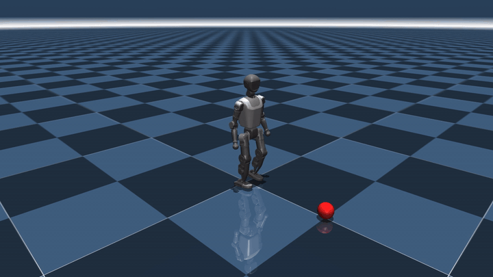
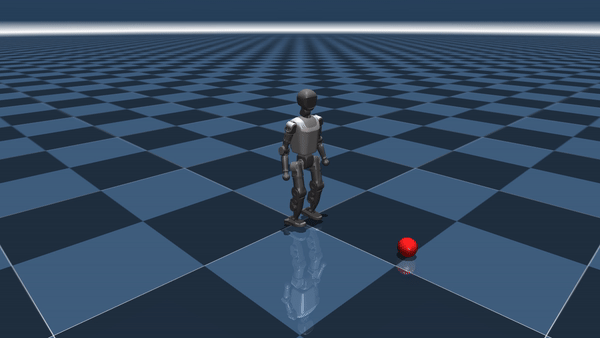
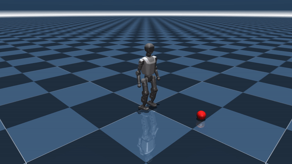
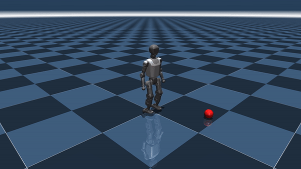

# HTWK Gym

HTWK Gym is a reinforcement learning framework for humanoid locomotion built on top of [Booster Gym](https://github.com/BoosterRobotics/booster_gym/tree/main). It supports training in Isaac Gym and sim2sim evaluation in MuJoCo for walking and ball-kicking behaviors.

## Sim2Sim Demo (MuJoCo)

[](demo_videos/sim2sim_two_policies.gif)

The robot walks to a ball with `ParameterWalk`, switches to `Kicking` to strike it, then continues forward.

**Ball angle setups at 1 meter distance:**

**10 deg** — [](demo_videos/demo_angle_10.gif)

**20 deg** — [](demo_videos/demo_angle_20.gif)

**30 deg** — [](demo_videos/demo_angle_30.gif)

---

## Supported Tasks

### T1 Robot

| Task | Config | Obs | Description |
|---|---|---|---|
| `T1/BaseWalk` | `envs/T1/Base_Walk.yaml` | 47 | Basic velocity-tracked walking |
| `T1/ParameterWalk` | `envs/T1/Parameter_Walk.yaml` | 54 | Parameterized gait (freq, foot yaw, body pitch/roll, feet offset) |
| `T1/Kicking` | `envs/T1/Kicking.yaml` | 44 | Ball-kicking with target-based rewards |

### K1 Robot

| Task | Config | Obs | Description |
|---|---|---|---|
| `K1/ParameterWalk` | `envs/K1/Parameter_Walk.yaml` | 54 | Parameterized walking on K1 |

---

## Installation

1. Create a Python 3.8 environment and install PyTorch with CUDA:
   ```sh
   python3.8 -m venv venv_isaac && source venv_isaac/bin/activate
   pip install torch==2.0.0 torchvision==0.15.0 --index-url https://download.pytorch.org/whl/cu118
   ```

2. Install [Isaac Gym](https://developer.nvidia.com/isaac-gym/download):
   ```sh
   tar -xzvf IsaacGym_Preview_4_Package.tar.gz
   cd isaacgym/python && pip install -e .
   ```

3. Install dependencies:
   ```sh
   pip install -r requirements.txt
   ```

---

## Usage

### Training

```sh
python train.py --task=T1/ParameterWalk --num_envs=4096
python train.py --task=T1/Kicking --num_envs=1024
```

Key args: `--checkpoint`, `--num_envs`, `--headless`, `--sim_device`, `--max_iterations`.

Track with TensorBoard: `tensorboard --logdir logs`

### Sim2Sim (MuJoCo)

Export trained checkpoints to TorchScript, then run the two-policy pipeline:

```sh
python export_model.py --task=T1/ParameterWalk --checkpoint=-1
python export_model.py --task=T1/Kicking --checkpoint=-1

# GUI mode (MuJoCo 3+, multi-agent env)
conda activate multi-agent
python sim2sim.py

# Headless → video
python sim2sim.py --headless --out videos/out.mp4
```

Key args: `--ball-dist`, `--ball-angle`, `--switch-dist`, `--vx`, `--duration`, `--walk-ckpt`, `--kick-ckpt`.

See [deploy/README.md](deploy/README.md) for deployment on the physical robot.

---

## License

HTWK Gym is developed by HTWK Robots and based on [Booster Gym](https://github.com/BoosterRobotics/booster_gym/tree/main). Pre-trained models may only be used in Robot Soccer Competitions with agreement from the HTWK Robots Team (robots@htwk-leipzig.de).
